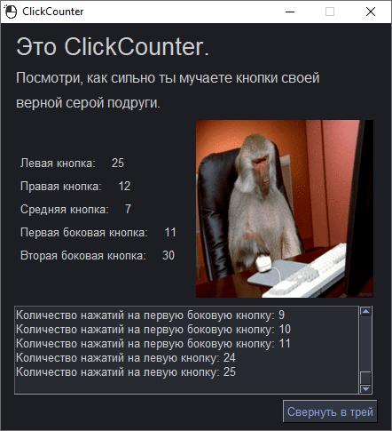

# ClickCounter
ClickCounter can count number of mouse click.

The utility allows you to count the clicks of 5 mouse buttons in the background (left, right, pressing the wheel and 2 side buttons) and display the sequence of clicks.

